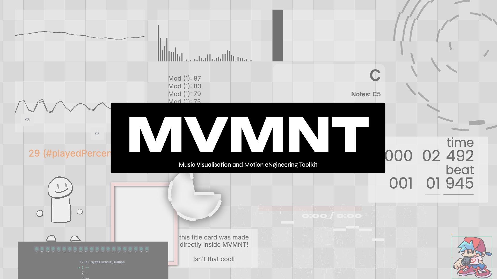

# MVMNT

<p align="center">
  <a href="https://maok.us">
    
  </a>
</p>

MVMNT (pronounced _movement_) is a free and open source music visualisation software that uses design inspired by audio and animation tools to provide a new and flexible way of creating music-reactive visuals.

For developers, it is a framework which handles the boilerplate so that you can focus on making and sharing custom visualisations.

- [Installation](#installation)
- [Making Plugins](#making-plugins)
- [License](#license)

## Installation

```bash
git clone https://github.com/Maokus/MVMNT.git
cd MVMNT
npm install
npm run dev
```

## Making Plugins

**Just want to make visualisations?** Read the [Plugin Development Quickstart](docs/plugin-quickstart.md).

One main goal of this project was making coding music visualisations easier. With MVMNT, you can write, build, and distribute your own scene elements using the same API that the built-in elements use.

Plugins are TypeScript classes that extend `SceneElement`. They (1) declare their configurable properties and (2) implement a `_buildRenderObjects()` method that passes `RenderObject`s to the renderer to draw.

The `@mvmnt/plugin-sdk` module provides everything you need: the base class, render primitives, and access to the timeline, audio features, and timing data via a stable host API.

For a full reference see [Creating Custom Elements](docs/creating-custom-elements.md) and the [Plugin API v1 Reference](docs/plugin-api-v1.md).

## License

MVMNT is released under the GNU Affero General Public License v3.0 (AGPL-3.0). If you modify this software and make it available to users, you must also provide those users access to the complete corresponding source code of your modified version under the same license. See the [`LICENSE`](LICENSE) file for details.
