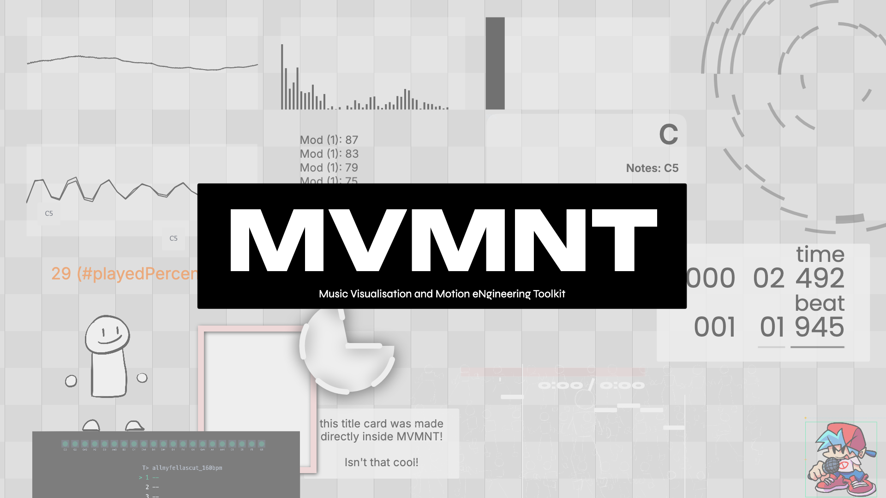

# MVMNT

<p align="center">
  <a href="https://maok.us">
    
  </a>
</p>

MVMNT (pronounced _movement_) is a free and open source music visualisation software that uses design inspired by audio and animation tools to provide a new and flexible way of creating music-reactive visuals.

For developers, it is a framework which handles the boilerplate so that you can focus on making and sharing custom visualisations.

- [Installation](#installation)
- [Windows Node/Electron recovery](#windows-nodeelectron-recovery)
- [Documentation](#documentation)
- [Making Plugins](#making-plugins)
- [License](#license)

## Installation

MVMNT requires **Node.js 22.12 or newer** (within the Node 22 release line). Node 20 is unsupported. On Windows,
install Node 22 from [nodejs.org](https://nodejs.org/) or switch with your Node version manager,
then open a new terminal and confirm `node --version` reports `v22.x`.

```bash
git clone https://github.com/Maokus/MVMNT.git
cd MVMNT
npm install
npm run dev
```

## Windows Node/Electron recovery

If `npm install` reports `EBADENGINE`, or `npm run dev` fails while downloading Electron with
`ERR_REQUIRE_ESM` or "Electron failed to install correctly", the project is using an unsupported
Node version. MVMNT requires Node 22.12 or newer within the Node 22 release line.

1. Install [NVM for Windows](https://github.com/coreybutler/nvm-windows/releases) (`nvm-setup.exe`),
   then close and reopen Git Bash or PowerShell.
2. Select the required Node version:

    ```bash
    nvm install 22.12.0
    nvm use 22.12.0
    node --version
    ```

    Confirm the final command reports `v22.12.0` or another `v22` version that is at least 22.12.

3. From the MVMNT checkout, remove the dependencies that were installed under the old Node version
   and install them again. In Git Bash:

    ```bash
    rm -rf node_modules
    npm install
    npm run dev
    ```

Do not delete `package-lock.json`, and do not use Electron's suggested manual installer; reinstalling
after switching Node installs the correct Electron binary.

## Documentation

The [documentation index](docs/README.md) provides separate paths for application contributors and
external plugin authors. Architecture, state, persistence, rendering, audio, desktop, and plugin
contracts are documented there.

## Making Plugins

Start with the [Plugin SDK 2 quickstart](docs/plugin-api/quickstart.md). External plugins use
`definePluginElement()` and import only `@mvmnt-app/plugin-sdk` or its documented subpaths. MVMNT
injects capability-scoped timeline, timing, audio, and asset services into lifecycle and render
callbacks.

Download MVMNT and create a plugin in a neighboring directory:

```bash
git clone https://github.com/Maokus/MVMNT.git
cd MVMNT
npm install
cd ..
npm create mvmnt-plugin@latest -- --name com.example.my-plugin --template minimal
cd my-plugin
npm install
```

Start both development servers in separate terminals. From the MVMNT checkout, run:

```bash
npm run dev
```

From the generated plugin directory, run:

```bash
npm run dev
```

Then open **Scene Settings → Developer** in MVMNT and scan for the Development Plugin Server.
The plugin generator creates a complete project with validation, hot reload, and packaging.

## License

MVMNT is released under the GNU Affero General Public License v3.0 (AGPL-3.0). If you modify this software and make it available to users, you must also provide those users access to the complete corresponding source code of your modified version under the same license. See the [`LICENSE`](LICENSE) file for details.
