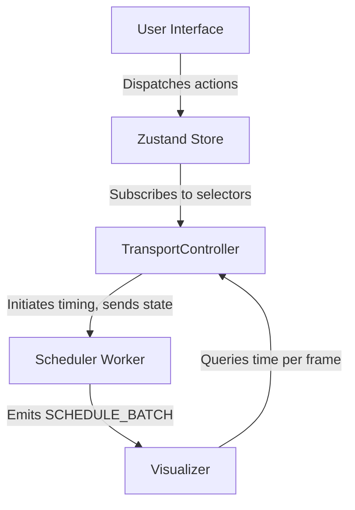

Here’s a high‑level, end‑to‑end design for a robust timing and transport management system that cleanly separates concerns, scales with complexity, and stays in sync across the zustand store, the UI, and the core Visualizer.

Goals
- Single source of truth: Transport state lives in the zustand store; all other layers derive from it.
- Deterministic timing: A stable master clock with look‑ahead scheduling and drift correction.
- Clear layering: Pure data (timeline), transport control, scheduler, and rendering are decoupled.
- Real‑time safe: Scheduling runs off the UI thread; UI and Visualizer consume read‑only snapshots.
- Extensible: Supports tempo changes, looping, scrubbing, quantization, and track/event plugins.

Layered Architecture
1) Core timebase and transport controller
- Responsibility
  - Maintain musical time (bars:beats:ticks) ↔ real time (seconds) mapping using a TempoMap.
  - Hold and transition transport state: stopped, starting, playing, pausing, seeking, looping.
  - Provide a monotonic, drift‑corrected “now” function for all consumers.
  - Orchestrate the scheduler (start/stop/seek) and publish transport ticks.
- Implementation
  - Master clock: AudioContext.currentTime as the base (most stable browser clock). If no audio, still create an AudioContext (can be silent) to leverage its clock. Fallback to performance.now() if needed.
  - Look‑ahead window: e.g., 100–200 ms. Refill scheduled events every 25–50 ms from a Worker/Worklet.
  - TempoMap: List of tempo/time signature segments with cumulative timing offsets for fast conversion between musical and real time.
  - Looping: Maintain loopStart, loopEnd in musical time; on wrap, emit a boundary event and reschedule within the window beyond loop end.
  - Quantization: Optional quantized start/stop/seek aligned to grid; configurable (e.g., 1/4, 1/16).
- Public API (imperative)
  - play(opts?: { quantizeTo?: GridValue })
  - pause()
  - stop()
  - seek(to: TimePoint, opts?: { snap?: GridValue })
  - setTempo(bpm), setTimeSignature(numerator, denominator), setRate(rate), setLoop({ on, start, end })
  - getNow(): { secTime, musicalTime, audioTime }
  - subscribe(fn): subscribe to transport ticks and state changes (thin wrapper around store selectors)

2) Timeline data model (pure state)
- Entities
  - Track: id, type, mute/solo, color, pluginType, params
  - Clip/Region: id, trackId, start, end, contentRef, offset, looped, gain, fades
  - Event: id, trackId, start, duration, type, payload (keyframes, cues, automation points)
  - Automation: paramId, points [{ time, value, curve }]
  - Markers: id, time, label, color
  - TempoMap: segments [{ start, bpm, timeSig, swing, cumulativeSec }]
- Time representations
  - Musical time as primary: bars:beats:ticks (BBT) or float beats. Store both beatTime and cached secTime via TempoMap for fast lookups.
  - Provide utility converters: beatsToSec, secToBeats, bbtToBeats, beatsToBBT using TempoMap.
- Invariants
  - No overlapping clips on a single track unless the track type allows it (e.g., layered).
  - Events sorted by start; O(log n) insertion and range queries.
  - All mutations are pure; derived caches recomputed incrementally.

3) Scheduler (Worker/Worklet)
- Responsibility
  - Convert the current transport window [now, now + lookAhead] into scheduled “renderable” events.
  - Perform minimal, incremental recompute when state changes (seek, tempo change, edit).
  - Emit schedule batches to consumers: Visualizer (for draw triggers) and any audio/physics engines.
- Design
  - Runs in a Web Worker to avoid UI jank. Receives snapshots of relevant store slices via postMessage.
  - Maintains a min‑heap priority queue keyed by absolute secTime for scheduled events/callbacks.
  - On each tick from the transport controller, fill the queue up to now + lookAhead; pop events whose time enters now.
  - Compiled schedule cache per track: Transform clips + events → time‑ordered triggers with resolved parameter curves and fades. Diff on edits to avoid full recompute.
  - Loop handling: On crossing loopEnd, fast‑reseed queue with loopStart‑relative times.
- Output
  - Batches: [{ timeSec, timeBeats, trackId, eventId, type, payload, renderHints }] grouped per 10–20 ms or per animation frame window.

4) Zustand store integration
- Slices
  - transportSlice
    - state: status, isPlaying, positionBeats, positionSec, rate, bpm, timeSig, loop { on, startBeats, endBeats }, latencyComp, quantize, swing, startTimeAnchor (audioTime when play began)
    - actions: play, pause, stop, seek, setTempo, setTimeSig, setLoop, setQuantize, setRate
  - timelineSlice
    - state: tracks, clips, events, automation, markers, tempoMap
    - actions: add/update/remove track/clip/event, setAutomation, setMarkers, setTempoMap
  - uiSlice (read‑only for timing, but drives interactions)
    - state: selection, toolMode, gridResolution, zoom, scroll, hover, drag state
    - actions: setSelection, setGrid, setZoom, setScroll
- Flow
  - UI dispatches actions to store only. Transport controller is subscribed to specific selectors and reacts (imperatively) to initiate clock operations and message the scheduler worker.
  - Worker subscribes to diffed snapshots: timelineSlice + needed transportSlice fields. The bridge sends compact patches instead of whole trees.
  - Visualizer subscribes to derived read‑only selectors and to scheduler outputs.

5) UI integration
- Controls
  - Transport bar: play/pause/stop, position display (BBT + sec), tempo/time signature, loop toggles, quantize, snap, metronome.
  - Timeline canvas: scrubbing, dragging clips, resizing, drawing automation. All operations dispatch pure actions.
- Behavior
  - Scrub: on mouse down + move, dispatch seek(toBeats). During scrubbing, UI shows provisional pointer; when released, transport might snap/quantize seek based on settings.
  - Editing: changes to clips/events immediately update timelineSlice; scheduler receives diffs; visual feedback is instant due to derived selectors.
  - Zoom/Scroll: uiSlice only; rendering layers read zoom/scroll but timing remains independent.
- Performance
  - Use shallow‑equal selectors and memoized derived selectors for large timelines.
  - Debounce heavy operations (e.g., mass selection transforms) and coalesce into a single schedule recompute tick.
  - Render pointer position using transport.getNow() to avoid dependence on store update frequency.

6) Core Visualizer integration
- Contract
  - Visualizer initializes with a TransportHandle and a SchedulerFeed.
  - On each animation frame, it queries transport.getNow() and renders the playhead precisely at that time, independent of store update cadence.
  - It subscribes to scheduler batches to trigger time‑locked visuals (e.g., spawning particles at exact cue times), and interpolates automation values between triggers.
- Rendering ticks
  - requestAnimationFrame loop pulls the latest time and applies easing/curves; no internal timers needed besides rAF.
  - If the Visualizer needs deterministic replays, it can request a “fixed‑step mode” where the transport exposes stepping controls.

7) Messaging and boundaries
- Main thread ↔ Worker
  - Inbound: { type: 'INIT'|'UPDATE_STATE'|'SEEK'|'PLAY'|'PAUSE', payload: compactPatch }
  - Outbound: { type: 'SCHEDULE_BATCH', window: [startSec, endSec], events: [...] }
  - Optionally SharedArrayBuffer + Atomics for a ring buffer of schedule events and a clock handoff for ultra‑low latency.
- Transport ticks
  - Lightweight onTick delivered via a small emitter, used by pointer and metronome UI; Visualizer relies on getNow() for accuracy, not the event cadence.

8) Handling tempo changes and conversions
- TempoMap segments maintain cumulative seconds to support O(log n) conversion:
  - secToBeats(sec) and beatsToSec(beats) binary‑search the segment and use precomputed offsets.
- When bpm/time signature changes:
  - transportSlice updates tempoMap via timelineSlice.
  - Transport/controller recomputes anchors for position mapping.
  - Worker gets a diff and rebuilds only affected schedule segments.

9) Looping, rate, and drift correction
- Looping
  - Controller enforces loop boundaries at the clock level (position wraps in beats).
  - Worker sees loop window and schedules out to now + lookAhead beyond loop end (wrapping indices).
- Rate
  - Rate affects mapping (beats/sec). Keep TempoMap in beats; rate multiplies beatsToSec results globally.
- Drift
  - Each frame/tick, current positionBeats = beatsAtStart + (audioContext.currentTime - startTimeAnchor) * (bpm/60) * rate, mod loop if enabled. Periodically re‑anchor to reduce float drift.

10) Error handling and state machine
- Transport FSM
  - stopped → starting → playing → pausing → stopped
  - starting: prepare audio clock, seed worker; only after first confirmation move to playing.
  - pausing: stop scheduling first, then finalize position; avoid double‑firing events.
- Guards
  - No seek while starting; queue the intention and apply on playing.
  - On heavy edits, suspend scheduling, send a consolidated diff, resume.

11) Testing and determinism
- Provide a SimulatedClock for unit tests with manual advance(dt).
- Snapshot tests for schedule compilation: given timeline and tempoMap, expect specific triggers in a window.
- Property tests for loop boundaries, quantization, and tempo changes.

12) Extensibility
- Track plugins: register type → compile(trackState) → schedule(events) so new visual/audio types plug into the scheduler.
- Event types extensible via a registry with serializer/deserializer and renderHints.
- Optional audio engine: separate consumer of scheduler events; shares the same transport.

13) Persistence and history
- Serialization: timelineSlice + tempoMap are JSON‑serializable (no runtime refs).
- History: command stack of pure actions; time‑sensitive commands record old/new beats for stable undo across tempo changes.
- Versioned schema with migrations for future changes.

Zustand store outline (shape and key actions)
- transportSlice
  - status, isPlaying
  - positionBeats, positionSec (derived or cached)
  - bpm, timeSig, rate
  - loop: { on, startBeats, endBeats }
  - quantize, swing
  - actions: play(), pause(), stop(), seek(beats), setTempo(bpm), setTimeSig(n, d), setLoop(cfg), setRate(r), setQuantize(q)
- timelineSlice
  - tracks, clips, events, automation, markers, tempoMap
  - actions: addClip, moveClip, resizeClip, addEvent, editEvent, setAutomation, setMarkers, setTempoMap
- uiSlice
  - selection, toolMode, gridResolution, zoom, scroll, hover
  - actions: setSelection, setGridResolution, setZoom, setScroll

End‑to‑end flow example
- User hits Play
  - UI dispatches transport.play()
  - transportSlice updates → transport controller starts AudioContext clock, sets startTimeAnchor, sends PLAY to worker with current snapshot
  - Worker compiles schedule for [now, now + lookAhead] and starts emitting SCHEDULE_BATCH
  - Visualizer rAF queries transport.getNow() and renders pointer; also consumes scheduler batches for exact event triggers
- User drags a clip
  - UI dispatches moveClip(diff)
  - timelineSlice updates and emits a compact diff to worker
  - Worker recomputes only affected schedule segments; next batches reflect new positions
- User scrubs timeline
  - UI dispatches transport.seek(toBeats)
  - Controller updates position and sends SEEK to worker, which flushes queues and reseeds from new position

Migration path from the current messy system
- Phase 1: Carve out a read‑only transport facade
  - Implement transport.getNow() and replace all direct time reads in UI/Visualizer with it.
- Phase 2: Isolate timelineSlice and compile function
  - Move timeline data (tracks/clips/events) into a pure slice and implement a pure compileTimeline(window) function in isolation.
- Phase 3: Introduce Worker scheduler
  - Port compileTimeline into a Worker; add the look‑ahead loop and priority queue.
- Phase 4: Transport FSM and AudioContext clock
  - Replace ad‑hoc timers with AudioContext time and the FSM; add looping/seek correctness.
- Phase 5: Diff bridge and performance passes
  - Send compact patches to Worker; add memoized selectors; validate large‑project performance.

### 🧭 Component Architecture & Data Flow

This section outlines how the system layers communicate, who owns what, and how timing flows from user actions to visual output.

#### 🔹 Component Hierarchy and Responsibilities

| Layer      | Component             | Owns State?      | Reads From             | Writes To         | Responsibilities                                     |
| ---------- | --------------------- | ---------------- | ---------------------- | ----------------- | ---------------------------------------------------- |
| 🧠 State   | `Zustand Store`       | ✅ Transport/UI   | UI, Controller         | Subscribed layers | Holds declarative state for transport, timeline, UI  |
| 🕰 Control | `TransportController` | ✅ Internal clock | Zustand selectors      | SchedulerBridge   | Converts state into timing logic; exposes `getNow()` |
| 📦 Worker  | `Scheduler`           | ✅ Schedule queue | Transport snapshot     | Visualizer        | Schedules events in a look-ahead window for playback |
| 🎨 View    | `Visualizer`          | ❌ (derived only) | Scheduler + `getNow()` | —                 | Renders playback visuals and time-aligned effects    |

---

#### 🔹 Data & Control Flow



* **UI** dispatches pure actions to the store.
* **Zustand** reflects those updates declaratively.
* **TransportController** reacts to store changes to start/stop the AudioContext clock, manage `getNow()`, and communicate with the scheduler.
* **Scheduler** compiles renderable events and emits time-batched outputs.
* **Visualizer** uses `requestAnimationFrame` and `transport.getNow()` for precise rendering.

---

#### 🔹 Unidirectional Timing Flow

```
[User]
   ↓ dispatch
[Zustand Store]
   ↓ subscribed
[TransportController] → getNow()
   ↓ messages
[Scheduler Worker]
   ↓ batches
[Visualizer] → rAF(getNow())
```

---

#### 🔹 Key Separation Rules

* Only the **TransportController** talks to both the clock and the store.
* The **store is the single source of truth** for state — but not for real-time timing.
* The **Visualizer never drives time** — it only consumes it.
* The **Scheduler is isolated in a Worker**, ensuring real-time safety and avoiding UI thread jank.

Open questions for your context
- Do you have an audio engine (e.g., WebAudio/Tone.js) that must be sample‑accurate, or is this visuals‑only?
- Should start/stop be quantized to grid by default?
- Are tempo changes and time signature changes expected mid‑timeline?
- What’s the expected scale (tracks, events) so we can size the look‑ahead and batching?

If you confirm those, I can tailor the slice shapes, worker message schema, and key function signatures to your codebase conventions.