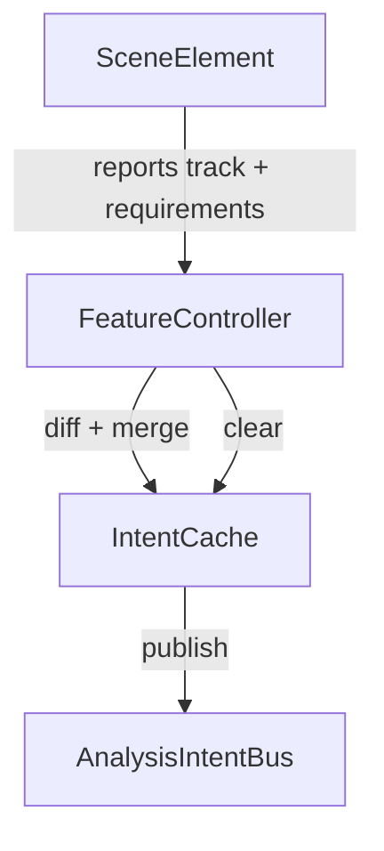

# Audio feature request pipeline

This document explains how feature requests are produced today, why `waveform`/`pitchWaveform` sometimes fail to appear, and a concrete plan for making the pipeline deterministic.

## How requests are produced today

1. **Static requirements.** Scene elements register their audio needs at module load using `registerFeatureRequirements` (see `src/audio/audioElementMetadata.ts`). For example, `audio-waveform.ts` and `audio-locked-oscilloscope.ts` both call:

    ```ts
    registerFeatureRequirements('audioWaveform', [{ feature: 'waveform' }]);
    registerFeatureRequirements('audioLockedOscilloscope', [{ feature: 'pitchWaveform' }]);
    ```

2. **Scene element bootstrap.** The `SceneElement` base class (`src/core/scene/elements/base.ts`) invokes `_subscribeToRequiredFeatures()` inside the constructor and whenever `setProperty('audioTrackId', …)` fires. This method pulls the registered requirements, reads the current `audioTrackId`, and calls `syncElementSubscriptions`.

3. **Descriptor normalization.** `syncElementSubscriptions` (`src/audio/features/subscriptionSync.ts`) maps each requirement into a calculator descriptor via `createFeatureDescriptor`, dedupes by identity (`buildDescriptorIdentityKey`), then pushes the list into `syncElementFeatureIntents`.

4. **Per-element intent cache.** `syncElementFeatureIntents` (`src/audio/features/sceneApi.ts`) stores descriptors in an internal `WeakMap` keyed by element object, keeps track of the active track, and calls `publishAnalysisIntent` whenever the descriptor set meaningfully changes. Clearing happens via `clearFeatureData`.

5. **Intent bus.** `publishAnalysisIntent` builds a hashed payload and, if it changed, emits a `publish` event on the analysis-intent bus (`src/audio/features/analysisIntents.ts`). It also applies defaults such as `getDefaultProfile()`.

6. **Consumers.**

    - The audio diagnostics pane (`src/state/audioDiagnosticsStore.ts`) subscribes to the bus to provide UI visibility and diffing.
    - The timeline/audio analysis pipeline watches intents and schedules calculators (see `audioFeatureAnalysis.ts` and `useTimelineStore`).
    - React utilities (`useAudioFeature.ts`) piggy-back on the same bus by presenting their own lightweight element refs.

7. **Sampling.** Runtime renderers fetch data through `sampleAudioFeatureRange`, `sampleFeatureFrame`, or `getFeatureData`. All three rely on cached descriptors and will silently return `null` until a cache entry is available.

### Contract summary

-   Inputs: `(elementId, elementType, trackId, descriptor[])` pairs and optional profile deltas.
-   Outputs: Cached feature tracks under `timelineStore.audioFeatureCaches` plus diagnostics metadata.
-   Error modes: Missing track ID, descriptor dedupe collisions, intent hash not changing (so publish wont re-run), cache regeneration failures.

## Observed pain points

| Symptom                                                                                                                        | Root cause                                                                                                                                                                                                                                                                | Notes                                                                                                                                            |
| ------------------------------------------------------------------------------------------------------------------------------ | ------------------------------------------------------------------------------------------------------------------------------------------------------------------------------------------------------------------------------------------------------------------------- | ------------------------------------------------------------------------------------------------------------------------------------------------ |
| `waveform` / `pitchWaveform` caches intermittently missing after the track binding switches via macro                          | `_subscribeToRequiredFeatures` only fires from `setProperty`. Macro updates (`subscribeToMacroEvents` in `SceneElement`) invalidate caches but never call `_subscribeToRequiredFeatures`, so the intent still points at the old track or is absent entirely.              | Repro: bind `audioTrackId` to a macro, change the macro target; diagnostics shows stale intent while renderers keep sampling the previous cache. |
| First-time render of a newly inserted element shows no request until the user edits another property                           | Some element instances are created with `id = null` (or trimmed to empty). `publishAnalysisIntent` exits early when `elementId` is falsy, so the first request is dropped. Once an `id` is assigned via `setProperty` everything works, but the initial cache is missing. |
| Developers mix auto-managed requirements and ad-hoc `getFeatureData` calls, seeing unexpected extra descriptors in diagnostics | `getFeatureData` also registers descriptors with potentially different `analysisProfileId` / overrides, creating separate intent entries. Diagnostics flags them as "unexpected" relative to the static requirement list.                                                 |
| Requirements silently depend on module side effects                                                                            | If the element module hasnt been imported yet, `registerFeatureRequirements` never runs. Lazy-loaded editors or tests can end up with empty requirement sets, so no request is published.                                                                                 |

## Hardening plan

### Phase 1  immediate fixes

1. **Macro-aware subscription refresh.**

    - When `_setupMacroListener` in `SceneElement` receives `macroValueChanged` for any property that affects feature requirements (currently just `audioTrackId`), re-run `_subscribeToRequiredFeatures()`.
    - When a macro is deleted or imported, also trigger a resubscribe before or after promoting the value to a constant binding.
    - Add a unit test that binds `audioTrackId` to a macro, changes the macro target, and asserts `publishAnalysisIntent` is re-fired with the new track.

2. **Guard against missing element IDs.**

    - Emit a warning (development builds) when `publishAnalysisIntent` drops a request because `elementId` is falsy, so we get telemetry instead of silent failure.
    - Optionally fall back to a generated UUID when the caller is a `SceneElement` with a defined `type` but no `id`.

3. **Diagnostics clarity.**
    - Surface the "last published track" inside diagnostics so stale intents are obvious (currently we only show the current diagram but not historical track IDs).

### Phase 2  unified subscription controller

Introduce a dedicated `FeatureSubscriptionController` that every `SceneElement` owns:

-   Maintains the last-seen `audioTrackId` and resolved requirement descriptors.
-   Subscribes directly to binding change events (both constant and macro) and diffs the normalized track ID on each tick.
-   Provides a typed API to register additional ad-hoc descriptors so manual `getFeatureData` requests flow through the same controller. This removes the current split brain between "auto-managed" and "manual" descriptors.
-   Applies debouncing so repeated identical values dont spam the bus. The controller can reuse the existing hash logic from `publishAnalysisIntent` for free.

Implementation sketch:



### Phase 3  long-term stability

-   **Requirement provenance metadata.** Tag each descriptor with the requirement source (static registry vs. call site) to power richer diagnostics and allow partial overrides.
-   **Module registration health check.** On dev builds, assert that every instantiated element type had its requirements registered; this catches lazy-import slips.
-   **Regression harness.** Add integration coverage that walks through the audio display palette, binds macros, swaps tracks, and verifies that caches appear within a bounded time window.

## Next steps & owners

| Task                                             | Suggested owner | Notes                                                      |
| ------------------------------------------------ | --------------- | ---------------------------------------------------------- |
| Implement macro refresh + warning guard          | Core runtime    | Touches `SceneElement`, easy to ship.                      |
| Backfill unit test for macro-bound track changes | QA/Runtime      | Build atop existing `sceneApi` tests.                      |
| Prototype `FeatureSubscriptionController`        | Core runtime    | Start by extracting logic from `syncElementSubscriptions`. |
| Extend diagnostics with track history            | Tooling         | Uses existing `intentsByElement` map.                      |

Once Phase 1 lands, the `waveform` and `pitchWaveform` intents become stable because track changes are actually observed. Phases 2 and 3 reduce future drift, clarify diagnostics, and make the system resilient against registration order and mixed-request scenarios.
